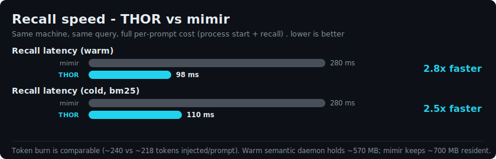

# THOR vs mimir - the full picture

An honest, measured comparison of THOR against
[mimir](https://github.com/MakerViking/mimir) on the same machine - not just raw
horsepower, but quality, speed, cost per turn, and the structural properties.
Every number below is measured or verifiable; nothing is invented, and the
weaknesses are listed in full.

## 1. Recall quality (blind-judged)

- **52 real questions across 6 categories.** Each ships with a written *"what a
  correct answer must contain"* ground truth. The corpus references private
  project internals, so only the aggregate scores are published - not the
  questions.
- Both systems return their **top-5** per question. An independent judge scores
  each set **0-2** (2 = a hit clearly contains the answer, 1 = on-topic/partial,
  0 = miss), **blind** to which system produced which (sets relabelled A/B,
  ids stripped, so it scores on content alone).
- **Result: THOR 85.6% vs mimir 74.0%** answer-presence. THOR wins or ties every
  category and loses none. The semantic layer closed the paraphrase gap mimir used
  to lead: code-behavior 0.88 -> 1.25 (caught mimir), doc-reference 1.33 -> 1.78
  (moved ahead). Measured internally, score-fusion lifts THOR's own recall@5 from
  67% to 73%.

## 2. Recall speed

Full per-prompt cost (process start + recall), median of several runs, same query:

- THOR (warm daemon): **~98 ms**. THOR (cold, bm25 fallback, no daemon): **~110 ms**.
- mimir: **~280 ms**.
- **THOR is ~2.5-2.8x faster - even cold**, so the speed is not just the warm
  daemon.

## 3. Cost per turn

| | THOR | mimir |
|---|---|---|
| Tokens injected / prompt | ~240 | ~218 |
| Resident RAM | ~570 MB (semantic daemon) / **0** (bm25 default) | ~700 MB observed |

Token burn is **comparable** - neither wins. THOR's optional semantic mode keeps a
warm ~570 MB embedder resident; its default bm25 mode needs no resident process at
all. mimir keeps ~700 MB resident on this machine.

## 4. What each is built for (structural)

| property | THOR | mimir |
|---|---|---|
| Lossless on conflict | branch-on-conflict (both heads kept, never a silent overwrite) | last-write-wins |
| Tamper-evident | hash-chained log + `fsck` | - |
| Moment-of-action guard | yes (PreToolUse advisory) | - |
| Cross-machine sync | log-shipping (verbatim, hash-identical) | hub sync |
| Needs git | no | no |
| Code-graph (symbols) | no (by design) | yes |

THOR is an append-only, lossless, tamper-evident memory plus a guard. mimir adds a
code-symbol graph that THOR deliberately does **not** replicate.

## Honest weaknesses

- **Quality:** code-behavior is a **tie** - pure paraphrase ("what does X do when
  Y") is the hardest category for *both*, and ~40% is left on the table. THOR's
  overall lead is partly its code-structure advantage; strip that one category and
  it is **84.9% vs 82.6%** - a slim edge, no longer a loss on the rest.
- **Semantic-mode cost:** needs a ~235 MB model file plus a ~570 MB warm daemon
  (client-only, **off by default**; recall degrades cleanly to bm25 without it).
- **Maturity:** THOR is new; mimir is battle-tested in daily use.
- **No code-graph:** for "which functions call X" mimir routes to a symbol graph;
  THOR chunks source directly (which is *why* it wins code-structure here) but has
  no graph queries.
- **Measurement caveats:** one machine, one 52-question set, a single judge per
  question, and a private corpus - so these exact numbers are not independently
  reproducible from this repo. Harness: `thor/examples/recall_eval.rs` + a
  blind-judge pass; latency is `thor courier` vs `mimir recall`, wall-clock.
